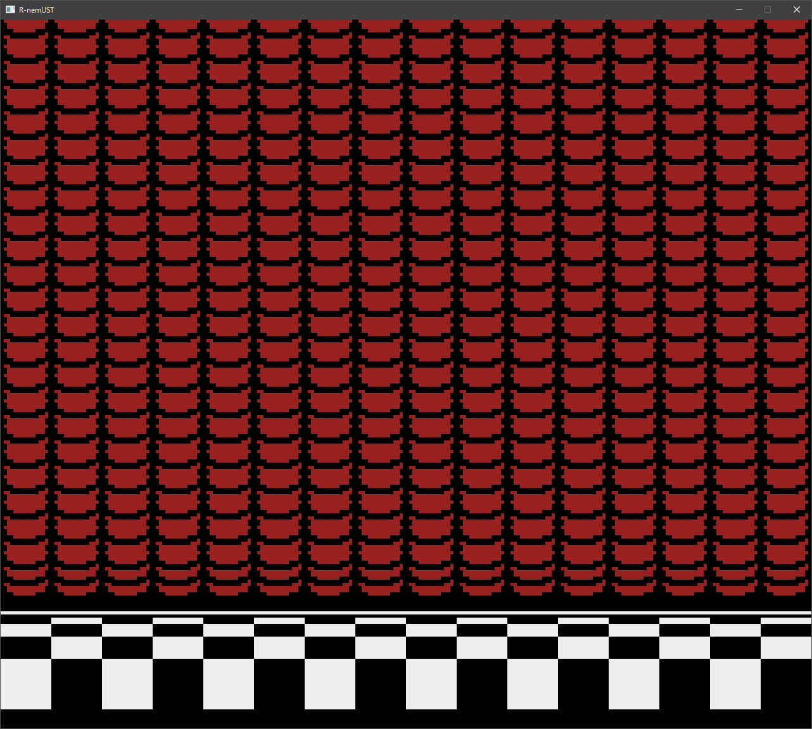

## Summary

This is a "cycle-accurate" NES emulator, meaning the hardware is emulated at the granularity of individual CPU/PPU cycles rather than one CPU instruction at a time. 
This allows for emulating games that depend on hardware quirks (open bus behaviour, dummy reads, tight interrupt timings) without relying on game-specific hacks.

This project is not based on any existing emulator and was not developed with reference to any existing emulator code. 
It has been written to match the behaviour of NES hardware as described by/on/in:
- [NESdev Wiki](https://www.nesdev.org/wiki/Nesdev_Wiki)
- [NESDev Forums](https://forums.nesdev.org/)
- [Visual 6502](http://www.visual6502.org/)
- [Michael Steil's 65XX CPU reference](https://www.pagetable.com/c64ref/6502/?tab=2)
- [John West and Marko Mäkelä's 65XX instruction set documentation](docs/6502_cpu.txt)
- [Adam Vardy's unofficial opcode documentation](docs/nes-opcodes-cpu-cycle-documentation-description.txt)
- [This photocopy of a Synertek 65XX hardware manual](docs/synertek_hardware_manual-SEARCHABLE.pdf)
- [NES test roms](https://github.com/christopherpow/nes-test-rom)

## Features
- Cycle-accurate emulation with full audio/video support (CPU, PPU and APU implemented)
- Support for both keyboard & controller input with multiple mappings
- "Rewind" save-state feature (shown below ⬇️)
- Adjustable emulation speed
- CPU debugger (in development)

### Supported mappers
- [iNES mapper 0 / NROM](https://nesdir.github.io/mapper0.html)
- [iNES mapper 1 / MMC1](https://nesdir.github.io/mapper1.html)
- [iNES mapper 2 / UxROM](https://nesdir.github.io/mapper2.html)
- [iNES mapper 3 / CNROM](https://nesdir.github.io/mapper3.html)
- [iNES mapper 4 / MMC3](https://nesdir.github.io/mapper4.html)
- [iNES mapper 7 / AxROM](https://nesdir.github.io/mapper7.html)

These mappers cover over 1000 games!
