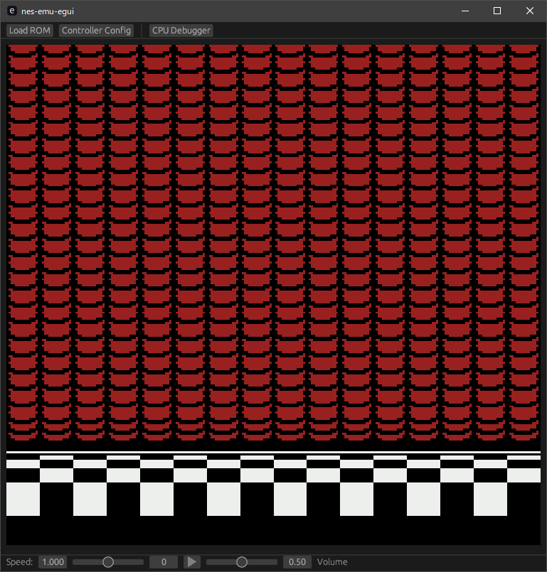

## Summary

A cycle-accurate NES emulator written in Rust 🦀 with an [egui](https://github.com/emilk/egui) frontend. 
Cycle-accuracy in this context means that the hardware is emulated one CPU cycle at a time (rather than one CPU instruction at a time). 
This supports the emulation of games that depend on hardware quirks (open bus behaviour, dummy reads, tight interrupt timings) without relying on game-specific hacks.

## Features
- Cycle-accurate emulation with full audio/video support (CPU, PPU and APU implemented)
- Controller support with configurable button mappings
- "Rewind" save-state feature (shown below ⬇️)
- Adjustable emulation speed
- CPU debugger (in development)

## Supported Games
Games with any of the following mappers are supported. This covers over 1000 NES games.
- [iNES mapper 0 / NROM](https://nesdir.github.io/mapper0.html)
- [iNES mapper 1 / MMC1](https://nesdir.github.io/mapper1.html)
- [iNES mapper 2 / UxROM](https://nesdir.github.io/mapper2.html)
- [iNES mapper 3 / CNROM](https://nesdir.github.io/mapper3.html)
- [iNES mapper 4 / MMC3](https://nesdir.github.io/mapper4.html)
- [iNES mapper 7 / AxROM](https://nesdir.github.io/mapper7.html)

A handful of games are known to not work (one of which is Battletoads) due to a bug in my sprite 0 hit detection.

## Installation
Compiled binaries aren't yet available, so you must build from source.
First install [Rust](https://www.rust-lang.org/tools/install) if you haven't already.

    git clone https://github.com/AdamBlance/nes-emu.git
    cd nes-emu
    cargo build --release

A specific version of Rust nightly (as defined in `rust-toolchain.toml`) should be automatically installed when attempting to build (as the emulator depends on unstable features). 

Run with `cargo run --release`. Note that without the `--release` flag the emulator will not perform well.

If the emulator is struggling to keep up, try uncommenting the following lines in `Cargo.toml` and building again. 

    [profile.release]
    lto = "fat"
    codegen-units = 1

The compilation will take a long time but this should yield a binary that performs better. 

## References
This project is not based on any existing emulator and was not developed with reference to any existing emulator code. 
It has been written to match the behaviour of NES hardware as described by/on/in:
- [NESdev Wiki](https://www.nesdev.org/wiki/Nesdev_Wiki)
- [NESDev Forums](https://forums.nesdev.org/)
- [Visual 6502](http://www.visual6502.org/)
- [Michael Steil's 65XX CPU reference](https://www.pagetable.com/c64ref/6502/?tab=2)
- [John West and Marko Mäkelä's 65XX instruction set documentation](docs/6502_cpu.txt)
- [Adam Vardy's unofficial opcode documentation](docs/nes-opcodes-cpu-cycle-documentation-description.txt)
- [This photocopy of a Synertek 65XX hardware manual](docs/synertek_hardware_manual-SEARCHABLE.pdf)
- [NES test roms](https://github.com/christopherpow/nes-test-rom)
